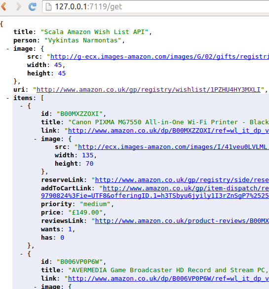
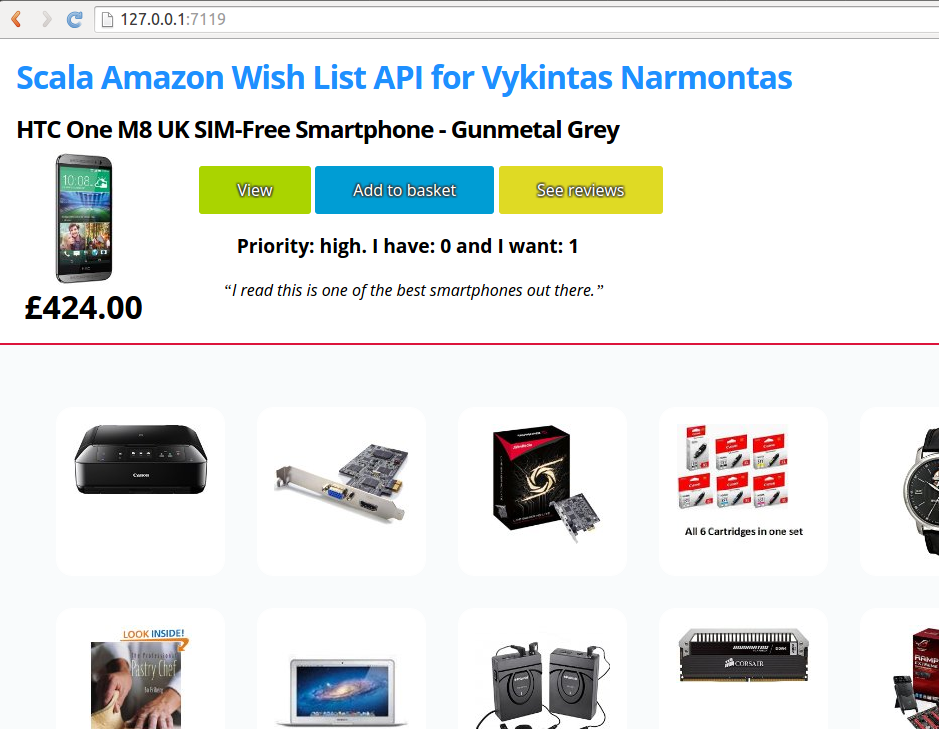
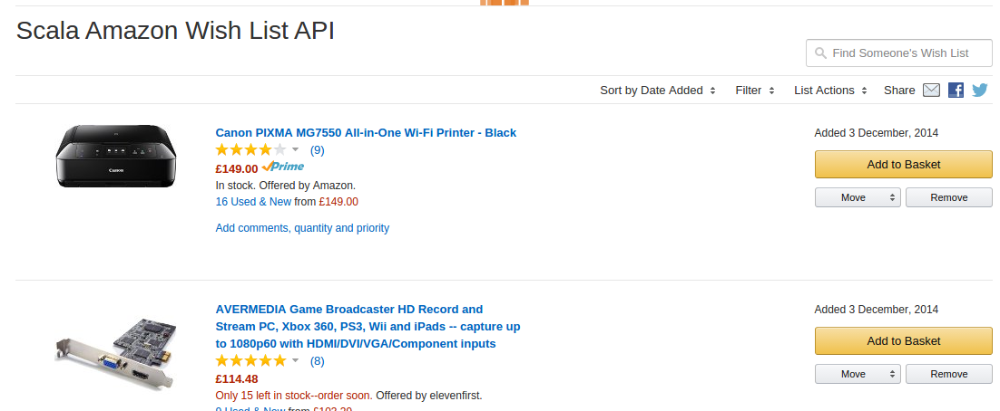

Scala version for Amazon Wishlist API.

Demo:
http://demo.scalawilliam.com/amazon-wishlist-api/

Every push to master is deployed continuously and automatically with courtesy of AWS SQS.

Stuff:
* Play 2.4.2
* sbt 0.13.9-M1
* Scala 2.11.7
* spray-client 1.3.3
* React
* JSoup

This trawler does deal with large Wishlists, ie composed of multiple pages.
